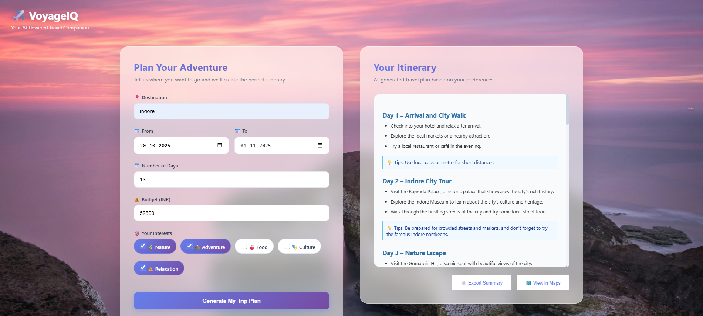

# VoyageIQ – AI Travel Itinerary Planner

VoyageIQ is a modern, AI-powered web app that helps you plan smarter and travel better. Enter your trip details, and let the app generate a personalized, day-by-day itinerary using Groq AI. Export, share, and visualize your trip with ease!

---

## Features
- Enter destination, travel dates, number of days, budget, and interests
- Get instant, personalized itineraries powered by Groq AI
- Export your trip as PDF or TXT
- View key locations in Google Maps
- Beautiful, responsive UI with custom backgrounds and icons
- Share your trip with friends

## Screenshots

| Home Page | Planner | Export | How It Works |
|---|---|---|---|
|  |  |  |  |

## Setup & Installation

1. **Clone the repository:**
	```bash
	git clone https://github.com/CzPhantom10/Travel-Itinerary-Planner.git
	cd Travel-Itinerary-Planner
	```
2. **Create and activate a virtual environment:**
	```bash
	python -m venv myenv
	myenv\Scripts\activate 
	```
3. **Install dependencies:**
	```bash
	pip install -r requirements.txt
	```
4. **Set up your Groq API key:**
	- Create a `.env` file in the project root.
	- Add: `GROQ_API_KEY=your_api_key_here`

5. **Run the app:**
	```bash
	python app.py
	```

## Project Structure
```
├── app.py
├── requirements.txt
├── .env
├── myenv/
├── static/
│   ├── css/
│   ├── images/
│   └── js/
├── templates/
│   ├── home.html
│   ├── index.html
│   ├── export.html
│   └── ...
```

## License
© 2025 VoyageIQ. All rights reserved.
